# 02 — BUSINESS REQUIREMENTS

> **ImpactAqiqah** — *"Tunaikan Ibadah, Tebarkan Manfaat"*

| Field | Value |
|-------|-------|
| Dokumen | 02_BUSINESS_REQUIREMENTS |
| Versi | 1.0 |
| Tanggal | 2026-06-14 |
| Status | Draft — menunggu approval |

---

## 1. Business Goals

| Kode | Goal | Indikator keberhasilan |
|------|------|------------------------|
| BG1 | Tingkatkan kepercayaan peserta lewat transparansi | ≥ 90% peserta menerima laporan tepat waktu tanpa menanyakan. |
| BG2 | Tingkatkan efisiensi operasional | Waktu koordinasi per order turun signifikan; nol order "hilang". |
| BG3 | Kontrol & visibilitas manajemen | Direktur/Manager memantau seluruh cabang dari satu dashboard. |
| BG4 | Standardisasi proses lintas cabang | Semua cabang mengikuti workflow yang sama & terukur. |
| BG5 | Kapasitas tumbuh tanpa menambah beban admin | Volume order naik tanpa proporsional menambah staf koordinasi. |
| BG6 | Akuntabilitas & kepatuhan syariah-operasional | Setiap order punya jejak bukti pemotongan & distribusi. |

## 2. Stakeholder Mapping

| Stakeholder | Peran terhadap sistem | Kepentingan utama | Pengaruh |
|-------------|----------------------|-------------------|----------|
| Direktur | Pengguna (executive) | KPI agregat, risiko, kepatuhan | Tinggi |
| Manager Program | Pengguna (operasional pusat) | Progres program, alokasi sumber daya | Tinggi |
| Admin Pusat | Pengguna (validasi pusat) | Mutu & keabsahan dokumentasi seluruh cabang | Tinggi |
| Admin Cabang | Pengguna (operasional cabang) | Input order, jadwal, koordinasi petugas | Tinggi |
| Petugas Lapangan | Pengguna (eksekusi) | Tugas harian, upload dokumentasi | Tinggi |
| Peserta / Donatur | Penerima output | Laporan & bukti ibadah | Sedang |
| Penerima Manfaat | Subjek distribusi | (Tidak mengakses sistem) | Rendah |
| Tim IT / DevOps Zakat Sukses | Pemilik teknis | Keandalan, keamanan, biaya | Sedang |
| Supervisor Dokumentasi | Validator | Kualitas & keabsahan dokumentasi | Sedang |

## 3. User Roles (ringkas)

Detail hak akses penuh ada di **07_USER_ROLES**. Ringkasannya:

| Role | Cakupan | Inti tugas |
|------|---------|------------|
| **Direktur** | Semua cabang | Lihat KPI, laporan eksekutif, audit. |
| **Manager Program** | Semua cabang / per program | Kelola program, pantau progres, master data. |
| **Admin Pusat** | Semua cabang | Validasi dokumentasi tingkat-akhir terpusat. |
| **Admin Cabang** | Satu cabang | Input & kelola order, jadwal, tetapkan petugas. |
| **Petugas Lapangan** | Tugas yang ditugaskan | Update status, upload dokumentasi lapangan. |
| **Peserta** | Order miliknya (via link) | Lihat laporan publik (tanpa login). |

## 4. Business Process (high-level)

Proses bisnis inti yang didigitalkan (detail di **08_WORKFLOW_MAP**):

```mermaid
flowchart LR
    A[Order masuk] --> B[Pembayaran diverifikasi]
    B --> C[Penjadwalan & penetapan PIC/Lokasi]
    C --> D[Persiapan hewan]
    D --> E[Pemotongan]
    E --> F[Distribusi daging]
    F --> G[Dokumentasi foto/video/catatan]
    G --> H[Validasi Supervisor - Admin Pusat]
    H --> I[Laporan otomatis ke peserta]
    I --> J[Audit & arsip]
```

**Penjelasan tahap:**

1. **Order** — Peserta memesan (via admin/kanal eksternal); Admin Cabang mencatat order beserta jenis layanan (Aqiqah/Qurban/Sedekah Daging), jumlah hewan, dan preferensi.
2. **Payment** — Admin memverifikasi bukti pembayaran; status order naik ke "Paid".
3. **Schedule** — Admin menetapkan tanggal pemotongan, lokasi, dan Petugas (PIC).
4. **Preparation** — Hewan disiapkan & dicek kelayakan.
5. **Slaughter** — Petugas mencatat pelaksanaan pemotongan + bukti.
6. **Distribution** — Daging didistribusikan; titik/penerima dicatat.
7. **Documentation** — Foto/video/catatan diunggah; divalidasi Supervisor lalu Admin Pusat.
8. **Reporting** — Sistem membuat laporan PDF + halaman publik; link dikirim ke peserta.
9. **Audit** — Semua jejak tersimpan untuk penelusuran.

## 5. Constraints

| Kode | Constraint | Implikasi |
|------|-----------|-----------|
| C1 | Tech stack terkunci: Next.js 16, Supabase, PostgreSQL, Supabase Storage, n8n, Vercel, Google Maps, React PDF | Desain harus sesuai kapabilitas stack ini. |
| C2 | Petugas lapangan sering di area sinyal terbatas | PWA wajib offline-tolerant untuk capture & antrian upload. |
| C3 | Peserta tidak boleh wajib login | Laporan diakses via link unik (tokenized public page). |
| C4 | Beban puncak musiman (Idul Adha untuk Qurban) | Sistem harus tahan lonjakan order & upload. |
| C5 | Anggaran & tim kecil (fase awal) | Hindari overengineering; manfaatkan managed services (Supabase/Vercel). |
| C6 | Data peserta bersifat privat | Kontrol akses file & data privacy wajib (lihat **20_SECURITY_CHECKLIST**). |
| C7 | Internal-only (bukan multi-tenant) | Tidak ada isolasi tenant; cukup scoping per cabang. |

## 6. Assumptions

| Kode | Asumsi |
|------|--------|
| A1 | Setiap petugas lapangan memiliki smartphone dengan kamera. |
| A2 | Order awal diinput oleh Admin Cabang (kanal pemesanan eksternal di luar scope MVP). |
| A3 | Verifikasi pembayaran dilakukan manual oleh admin (belum ada gateway). |
| A4 | Struktur organisasi: Pusat → Cabang → Lokasi/Tim → Petugas. |
| A5 | Satu order dapat berisi lebih dari satu hewan. |
| A6 | Validasi dokumentasi dua tingkat: Supervisor lalu Admin Pusat. |
| A7 | WA dikirim via tautan wa.me (bukan WhatsApp Business API resmi) pada MVP. |
| A8 | Email keluar memakai layanan SMTP/transactional yang dipicu n8n. |

## 7. Risiko Bisnis (ringkas)

| Risiko | Mitigasi |
|--------|----------|
| Petugas tidak disiplin upload dokumentasi | Order tak bisa "selesai" tanpa dokumentasi tervalidasi; reminder otomatis (n8n). |
| Lonjakan order Qurban | Arsitektur scalable + managed services; uji performa (**21_TESTING_PLAN**). |
| Sinyal lapangan buruk | PWA offline queue untuk upload. |
| Kebocoran data peserta | RBAC + signed URL + audit trail (**20_SECURITY_CHECKLIST**). |
| Laporan telat | Otomasi generate & kirim laporan (**18_AUTOMATION_WORKFLOW**). |

---

### Referensi silang
- Visi & metrik → **01_PROJECT_VISION**
- Functional requirements & user stories → **03_PRODUCT_REQUIREMENTS**
- Hak akses per role → **07_USER_ROLES**
- Workflow detail → **08_WORKFLOW_MAP**
