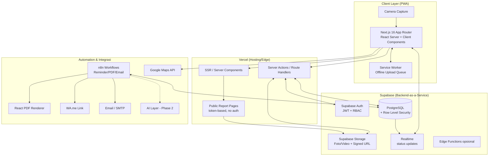
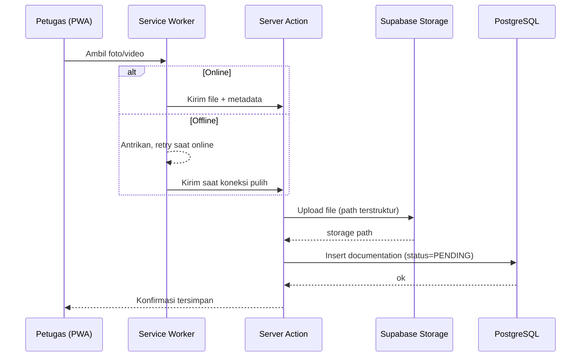
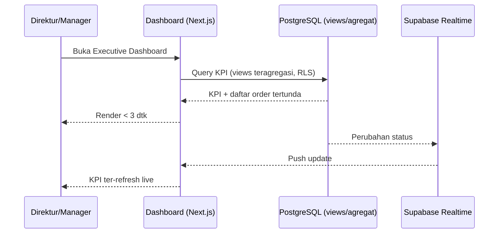
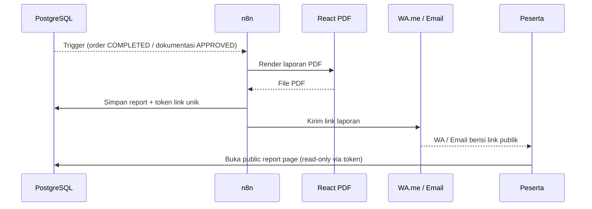

# 04 — SYSTEM ARCHITECTURE

> **ImpactAqiqah** — *"Tunaikan Ibadah, Tebarkan Manfaat"*

| Field | Value |
|-------|-------|
| Dokumen | 04_SYSTEM_ARCHITECTURE |
| Versi | 1.0 |
| Tanggal | 2026-06-14 |
| Status | Draft — menunggu approval |

---

## 1. Prinsip Arsitektur

1. **Managed-first** — manfaatkan Supabase & Vercel agar tim kecil fokus ke fitur, bukan infra.
2. **Single source of truth** — PostgreSQL (Supabase) sebagai pusat data; semua modul membaca/menulis ke sini.
3. **Server-centric Next.js** — App Router + Server Components/Server Actions; logika sensitif di server.
4. **Security at the data layer** — Row Level Security (RLS) PostgreSQL menegakkan scoping per cabang/role.
5. **Event-driven automation** — n8n menangani reminder, generate PDF, dan kirim notifikasi secara asinkron.
6. **PWA offline-tolerant** — antrian upload di klien untuk kondisi sinyal lapangan.
7. **Stateless app tier** — state di DB/Storage; app layer mudah diskalakan horizontal di Vercel.

## 2. High-Level Architecture

## 3. System Components

| Komponen | Teknologi | Tanggung jawab |
|----------|-----------|----------------|
| **Web/PWA Frontend** | Next.js 16 (App Router), React, Tailwind (lihat **14_UI_UX_SPEC**) | UI operasional, dashboard, form, kamera, offline queue. |
| **Server Actions / Route Handlers** | Next.js server runtime di Vercel | Mutasi data, validasi, orkestrasi ke Supabase. |
| **Public Report Pages** | Next.js (route publik bertoken) | Halaman laporan peserta tanpa login. |
| **Authentication** | Supabase Auth (JWT) | Login internal, sesi, klaim role/cabang. |
| **Database** | PostgreSQL (Supabase) + RLS | Sumber kebenaran data; penegakan akses di level baris. |
| **Storage** | Supabase Storage | Simpan foto/video; akses via signed URL. |
| **Realtime** | Supabase Realtime | Update status & dashboard live. |
| **Automation** | n8n | Reminder, generate PDF, kirim WA/email, jadwal. |
| **PDF Renderer** | React PDF | Membuat laporan PDF. |
| **Maps** | Google Maps API | Koordinat lokasi & visual peta. |
| **Notification channels** | WA.me, Email (SMTP/transactional) | Distribusi link laporan & reminder. |
| **AI Layer (Phase 2)** | Claude API | Executive summary, risk detector, report writer (**19_AI_LAYER**). |

## 4. Data Flow

### 4.1 Operasional (write path) — contoh: upload dokumentasi

### 4.2 Monitoring (read path) — dashboard real-time

### 4.3 Reporting & notifikasi (event-driven)

## 5. Integration Flow

| Integrasi | Arah | Pemicu | Catatan |
|-----------|------|--------|---------|
| Supabase Auth ↔ App | 2 arah | Login/refresh sesi | Klaim role & cabang dipakai RLS. |
| App ↔ PostgreSQL | 2 arah | Setiap operasi data | RLS aktif; akses via Server Actions. |
| App ↔ Storage | 2 arah | Upload/lihat media | Signed URL untuk akses terbatas waktu. |
| PostgreSQL → Realtime → App | 1 arah | Perubahan baris | Update dashboard & status live. |
| PostgreSQL/Webhook → n8n | 1 arah | Event status / jadwal cron | Memicu reminder & generate laporan. |
| n8n → React PDF | internal | Generate laporan | Output disimpan ke Storage + token. |
| n8n → WA.me / Email | keluar | Laporan siap / reminder | wa.me link & email transactional. |
| App → Google Maps | keluar | Tampilkan/isi lokasi | API key dibatasi domain. |
| n8n/App → AI (Phase 2) | keluar | Ringkasan/risk/report | Claude API; data diminimalkan. |

## 6. Environments

| Env | Tujuan | Catatan |
|-----|--------|---------|
| Development | Pengembangan lokal | Supabase project dev + Vercel preview. |
| Staging | UAT & uji performa | Data dummy; konfigurasi mirip prod. |
| Production | Operasional nyata | Backup terjadwal; monitoring aktif. |

Detail deployment → **22_DEPLOYMENT_PLAN**.

## 7. Cross-Cutting Concerns

- **Security & Privacy** → **20_SECURITY_CHECKLIST** (RLS, signed URL, audit trail, data minimization).
- **Observability** → log error, alert dashboard, metrik operasional (NFR-10).
- **Scalability** → app stateless di Vercel; DB connection pooling Supabase; Storage CDN-backed.
- **Resilience** → antrian upload offline; retry n8n; idempotensi pada generate laporan.

---

### Referensi silang
- Skema data & RLS → **05_DATABASE_DESIGN**
- Modul → **06_MODULE_BREAKDOWN**
- PWA → **13_PWA_ARCHITECTURE**
- Otomasi → **18_AUTOMATION_WORKFLOW**
- Deployment → **22_DEPLOYMENT_PLAN**
