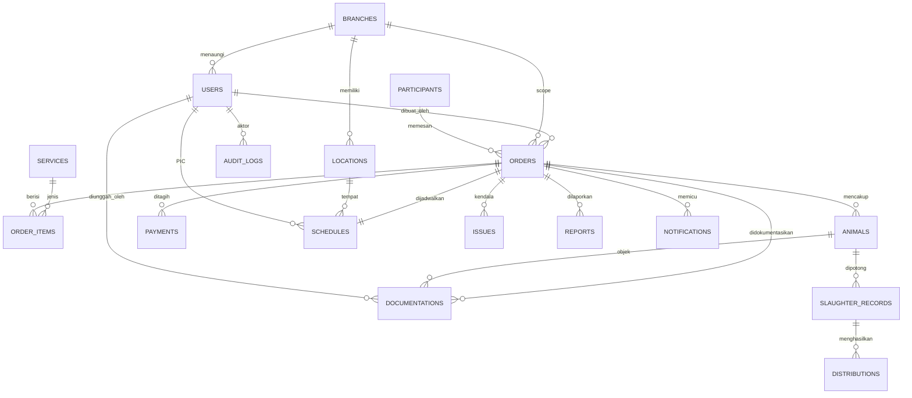

# 05 — DATABASE DESIGN

> **ImpactAqiqah** — *"Tunaikan Ibadah, Tebarkan Manfaat"*
> Dokumen ini adalah **sumber kebenaran entity** untuk **06_MODULE_BREAKDOWN** dan **16_API_SPEC**.

| Field | Value |
|-------|-------|
| Dokumen | 05_DATABASE_DESIGN |
| Versi | 1.0 |
| Tanggal | 2026-06-14 |
| DBMS | PostgreSQL (Supabase) + Row Level Security |
| Status | Draft — menunggu approval |

---

## 1. Konvensi

- Semua tabel pakai **`id uuid primary key default gen_random_uuid()`**.
- Timestamp: **`created_at`, `updated_at` (timestamptz, default now())**; trigger `updated_at`.
- Soft delete via **`deleted_at timestamptz null`** untuk entitas master penting.
- Penamaan: `snake_case`, tabel jamak (`orders`, `animals`).
- Enum diimplementasikan sebagai **PostgreSQL `enum` type** atau tabel lookup (lihat catatan).
- **RLS aktif** di semua tabel berisi data operasional; kebijakan berbasis `auth.uid()` + `role` + `branch_id`.
- Audit lewat tabel `audit_logs` + trigger pada perubahan status.

## 2. Entity List

| # | Entity | Deskripsi |
|---|--------|-----------|
| 1 | `users` (profiles) | Pengguna internal; extend `auth.users` Supabase. |
| 2 | `branches` | Cabang Zakat Sukses. |
| 3 | `locations` | Lokasi/titik pemotongan (punya koordinat). |
| 4 | `services` | Master jenis layanan: Aqiqah, Qurban, Sedekah Daging. |
| 5 | `participants` | Peserta/donatur. |
| 6 | `orders` | Order inti (state machine). |
| 7 | `order_items` | Rincian layanan/hewan per order. |
| 8 | `animals` | Hewan per order (ekor). |
| 9 | `payments` | Pembayaran & verifikasi. |
| 10 | `schedules` | Penjadwalan pemotongan + PIC + lokasi. |
| 11 | `slaughter_records` | Catatan pemotongan per hewan. |
| 12 | `distributions` | Catatan distribusi daging. |
| 13 | `documentations` | Foto/video/catatan + status validasi. |
| 14 | `reports` | Laporan peserta (PDF + token link publik). |
| 15 | `notifications` | Outbox notifikasi (WA/Email/Dashboard). |
| 16 | `audit_logs` | Jejak audit perubahan. |
| 17 | `issues` | Kendala/issue pada order. |

## 3. ERD

## 4. Table Definitions

> Tipe enum (status) didefinisikan sebagai PostgreSQL enum. Kolom audit (`created_at`, `updated_at`) tersirat di semua tabel.

### 4.1 `users` (profiles)
| Kolom | Tipe | Ket. |
|-------|------|------|
| id | uuid PK | = `auth.users.id` |
| full_name | text | |
| email | text unique | |
| phone | text | untuk WA |
| role | enum `user_role` | `direktur`,`manager_program`,`admin_pusat`,`admin_cabang`,`petugas_lapangan` |
| branch_id | uuid FK→branches | null untuk role pusat |
| is_active | boolean default true | |

### 4.2 `branches`
| Kolom | Tipe | Ket. |
|-------|------|------|
| id | uuid PK | |
| name | text | |
| code | text unique | |
| address | text | |
| phone | text | |

### 4.3 `locations`
| Kolom | Tipe | Ket. |
|-------|------|------|
| id | uuid PK | |
| branch_id | uuid FK→branches | |
| name | text | |
| address | text | |
| lat | numeric(9,6) | Google Maps |
| lng | numeric(9,6) | |

### 4.4 `services`
| Kolom | Tipe | Ket. |
|-------|------|------|
| id | uuid PK | |
| type | enum `service_type` | `aqiqah`,`qurban`,`sedekah_daging`,`nasi_box` |
| name | text | |
| description | text | |
| price | numeric(14,2) default 0 | harga jual total paket |
| meta | jsonb | rincian terstruktur: kambing `{harga_kambing,biaya_masak,hasil{...},cocok_untuk}`; nasi box `{items[]}` |
| is_active | boolean default true | |

> Katalog paket (3 kambing + 5 nasi box) di-seed via migration & **editable di dashboard** (`/programs`, role `manager_program`).

### 4.5 `participants`
| Kolom | Tipe | Ket. |
|-------|------|------|
| id | uuid PK | |
| name | text | |
| phone | text | untuk WA.me |
| email | text | untuk laporan |
| address | text | |

### 4.6 `orders`
| Kolom | Tipe | Ket. |
|-------|------|------|
| id | uuid PK | |
| order_number | text unique | format `IA-YYYYMM-####` |
| participant_id | uuid FK→participants | |
| branch_id | uuid FK→branches | scope RLS |
| created_by | uuid FK→users | |
| status | enum `order_status` | lihat §5 |
| payment_status | enum `payment_status` | `unpaid`,`partial`,`paid` |
| total_amount | numeric(14,2) | |
| notes | text | |
| public_token | text unique | token laporan publik |

### 4.7 `order_items`
| Kolom | Tipe | Ket. |
|-------|------|------|
| id | uuid PK | |
| order_id | uuid FK→orders | |
| service_id | uuid FK→services | |
| qty | int | jumlah hewan/paket |
| unit_price | numeric(14,2) | |
| meta | jsonb | preferensi (atas nama, dll) |

### 4.8 `animals`
| Kolom | Tipe | Ket. |
|-------|------|------|
| id | uuid PK | |
| order_id | uuid FK→orders | |
| tag_code | text | kode/tanda hewan |
| species | enum `animal_species` | `kambing`,`domba`,`sapi` |
| weight_kg | numeric(6,2) | opsional |
| status | enum `animal_status` | `registered`,`prepared`,`slaughtered`,`distributed` |
| on_behalf_of | text | atas nama (untuk aqiqah/qurban) |

### 4.9 `payments`
| Kolom | Tipe | Ket. |
|-------|------|------|
| id | uuid PK | |
| order_id | uuid FK→orders | |
| amount | numeric(14,2) | |
| method | text | transfer/tunai |
| proof_path | text | path Storage bukti |
| status | enum `payment_status` | |
| verified_by | uuid FK→users | |
| verified_at | timestamptz | |

### 4.10 `schedules`
| Kolom | Tipe | Ket. |
|-------|------|------|
| id | uuid PK | |
| order_id | uuid FK→orders unique | 1 order : 1 jadwal aktif |
| location_id | uuid FK→locations | |
| pic_user_id | uuid FK→users | Petugas Lapangan |
| scheduled_date | date | |
| scheduled_time | time | |
| status | enum `schedule_status` | `planned`,`ongoing`,`done` |

### 4.11 `slaughter_records`
| Kolom | Tipe | Ket. |
|-------|------|------|
| id | uuid PK | |
| animal_id | uuid FK→animals | |
| performed_by | uuid FK→users | |
| performed_at | timestamptz | |
| notes | text | |

### 4.12 `distributions`
| Kolom | Tipe | Ket. |
|-------|------|------|
| id | uuid PK | |
| order_id | uuid FK→orders | |
| slaughter_record_id | uuid FK→slaughter_records | nullable |
| recipient_name | text | titik/penerima |
| recipient_area | text | |
| packages_count | int | jumlah paket daging |
| distributed_by | uuid FK→users | |
| distributed_at | timestamptz | |
| lat | numeric(9,6) | opsional |
| lng | numeric(9,6) | opsional |

### 4.13 `documentations`
| Kolom | Tipe | Ket. |
|-------|------|------|
| id | uuid PK | |
| order_id | uuid FK→orders | |
| animal_id | uuid FK→animals | nullable |
| type | enum `doc_type` | `photo`,`video`,`note` |
| storage_path | text | path Supabase Storage |
| caption | text | catatan |
| stage | enum `doc_stage` | `slaughter`,`distribution`,`general` |
| status | enum `doc_status` | `pending`,`approved_supervisor`,`approved`,`rejected` |
| uploaded_by | uuid FK→users | |
| reviewed_by | uuid FK→users | nullable |
| review_note | text | alasan reject |

### 4.14 `reports`
| Kolom | Tipe | Ket. |
|-------|------|------|
| id | uuid PK | |
| order_id | uuid FK→orders | |
| pdf_path | text | path Storage PDF |
| public_token | text unique | token halaman publik |
| generated_by | text | `n8n`/user |
| generated_at | timestamptz | |
| version | int default 1 | |

### 4.15 `notifications`
| Kolom | Tipe | Ket. |
|-------|------|------|
| id | uuid PK | |
| order_id | uuid FK→orders | nullable |
| channel | enum `notif_channel` | `whatsapp`,`email`,`dashboard` |
| target | text | nomor/email/user |
| payload | jsonb | isi |
| status | enum `notif_status` | `queued`,`sent`,`failed` |
| sent_at | timestamptz | |

### 4.16 `issues`
| Kolom | Tipe | Ket. |
|-------|------|------|
| id | uuid PK | |
| order_id | uuid FK→orders | |
| reported_by | uuid FK→users | |
| severity | enum `issue_severity` | `low`,`medium`,`high` |
| title | text | |
| description | text | |
| status | enum `issue_status` | `open`,`in_progress`,`resolved` |
| resolved_at | timestamptz | |

### 4.17 `audit_logs`
| Kolom | Tipe | Ket. |
|-------|------|------|
| id | uuid PK | |
| actor_id | uuid FK→users | nullable (system) |
| entity | text | nama tabel |
| entity_id | uuid | |
| action | text | `create`,`update`,`status_change`,`delete` |
| before | jsonb | |
| after | jsonb | |
| created_at | timestamptz | |

## 5. State Machines (enum status)

**`order_status`** (sejalan dengan **08_WORKFLOW_MAP**):
`new → paid → scheduled → preparation → slaughtering → distribution → documentation → reporting → completed` (+ `on_hold`, `cancelled`).
> Catatan: status `paid` bermakna "**memenuhi syarat pembayaran untuk lanjut**" — yaitu `payment_status = paid` **atau** `partial` yang ≥ **DP minimum** (lihat kebijakan di bawah). Pelunasan penuh tetap ditargetkan sebelum `completed`.

**`payment_status`**: `unpaid → partial → paid`.
**Kebijakan gate pembayaran (DP/Partial diizinkan):** order boleh naik ke `scheduled` jika `payment_status = paid` **atau** `partial` dengan jumlah terbayar ≥ **`min_dp`**. `min_dp` dikonfigurasi di settings (default proporsi mis. 50%); dapat diset per layanan via `services.meta` bila diperlukan. Sisa pembayaran wajib lunas sebelum order `completed`.
**`doc_status`**: `pending → approved_supervisor → approved` | `rejected`.
**`schedule_status`**: `planned → ongoing → done`.
**`animal_status`**: `registered → prepared → slaughtered → distributed`.

## 6. Relationships (ringkas)

- `branches 1—N users`, `branches 1—N locations`, `branches 1—N orders`.
- `participants 1—N orders`.
- `orders 1—N order_items / animals / payments / documentations / issues / reports`.
- `orders 1—1 schedules`.
- `animals 1—N slaughter_records`; `slaughter_records 1—N distributions`.
- `users` berperan sebagai `created_by`, `pic_user_id`, `uploaded_by`, `reviewed_by`, `actor_id`.

## 7. Index Strategy

| Tabel | Index | Alasan |
|-------|-------|--------|
| orders | `(branch_id, status)`, `(payment_status)`, `(created_at)`, unique `(order_number)`, unique `(public_token)` | Filter dashboard & lookup. |
| schedules | `(scheduled_date)`, `(pic_user_id)`, `(location_id)`, unique `(order_id)` | Jadwal per petugas/lokasi. |
| documentations | `(order_id, status)`, `(status)`, `(uploaded_by)` | Antrian validasi. |
| animals | `(order_id, status)` | Progres per order. |
| distributions | `(order_id)`, `(distributed_at)` | Progres distribusi. |
| payments | `(order_id, status)` | Verifikasi. |
| reports | unique `(public_token)`, `(order_id)` | Akses publik cepat & aman. |
| audit_logs | `(entity, entity_id)`, `(created_at)` | Penelusuran. |
| notifications | `(status)`, `(channel)` | Outbox worker n8n. |

**Materialized/SQL Views untuk KPI dashboard** (mendukung jawaban < 10 detik, lihat **09_DASHBOARD_SPEC**):
- `v_order_progress` — agregat status per order (potong/distribusi/dokumentasi/laporan %).
- `v_branch_kpi` — KPI per cabang.
- `v_open_orders` — order belum selesai + lokasi + PIC + issue terbuka (inti litmus test).

## 8. Row Level Security (ringkas)

| Role | Aturan akses |
|------|-------------|
| `direktur`, `manager_program` | SELECT semua cabang; tulis terbatas (validasi/audit). |
| `admin_pusat` | SELECT semua cabang; UPDATE khusus validasi dokumentasi tingkat-akhir (`documentations`) & generate `reports`. |
| `admin_cabang` | CRUD data dengan `branch_id = profile.branch_id`. |
| `petugas_lapangan` | SELECT/UPDATE order/dokumentasi yang ditugaskan (PIC) saja. |
| Publik (anon) | Akses `reports`/media via token publik melalui fungsi keamanan, bukan tabel langsung. |

Detail kebijakan keamanan → **20_SECURITY_CHECKLIST**.

---

### Referensi silang
- Modul yang memakai entity ini → **06_MODULE_BREAKDOWN**
- Endpoint per entity → **16_API_SPEC**
- Workflow/state → **08_WORKFLOW_MAP**
- Storage path & naming → **17_STORAGE_STRATEGY**
