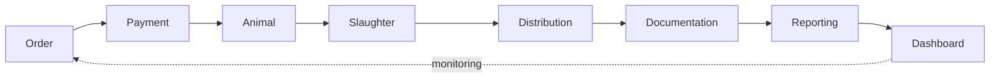

# 06 — MODULE BREAKDOWN

> **ImpactAqiqah** — *"Tunaikan Ibadah, Tebarkan Manfaat"*
> Entity yang dirujuk mengikuti **05_DATABASE_DESIGN** (sumber kebenaran).

| Field | Value |
|-------|-------|
| Dokumen | 06_MODULE_BREAKDOWN |
| Versi | 1.0 |
| Tanggal | 2026-06-14 |
| Status | Draft — menunggu approval |

---

## Peta Modul

Setiap modul didefinisikan dengan: **Tujuan · Entity utama · Fungsi inti · Aktor · Aturan kunci · Dependensi**.

---

## 1. Order Management

- **Tujuan:** Mencatat & mengelola seluruh order Aqiqah/Qurban/Sedekah Daging sebagai pusat operasional.
- **Entity utama:** `orders`, `order_items`, `participants`, `services`, `issues`.
- **Fungsi inti:**
  - Buat/ubah order, generate `order_number` unik.
  - Kelola item & jumlah hewan; tautkan peserta.
  - Ubah status order (state machine, **08_WORKFLOW_MAP**).
  - Pencarian/filter (status, cabang, lokasi, PIC, tanggal, jenis).
  - Tandai & kelola `issues`.
- **Aktor:** Admin Cabang (CRUD), Manager/Direktur (lihat), Petugas (update terbatas).
- **Aturan kunci:** Order ter-scope per `branch_id`; transisi status hanya yang valid; semua perubahan → `audit_logs`.
- **Dependensi:** dasar bagi semua modul lain.

## 2. Payment Management

- **Tujuan:** Mencatat & memverifikasi pembayaran agar order layak lanjut.
- **Entity utama:** `payments`, `orders.payment_status`.
- **Fungsi inti:**
  - Catat tagihan & pembayaran (Unpaid/Partial/Paid).
  - Upload bukti transfer ke Storage; verifikasi oleh admin.
  - Sinkronkan `orders.payment_status`.
- **Aktor:** Admin Cabang (verifikasi), Manager (lihat).
- **Aturan kunci:** **DP/Partial diizinkan** — order bisa `scheduled` jika lunas atau terbayar ≥ `min_dp` (configurable); **pelunasan penuh wajib sebelum `completed`**; verifikasi tercatat (`verified_by/at`).
- **Dependensi:** Order Management.

## 3. Animal Management

- **Tujuan:** Mengelola hewan per order dari registrasi hingga distribusi.
- **Entity utama:** `animals`.
- **Fungsi inti:**
  - Registrasi hewan (species, tag_code, atas nama).
  - Update `animal_status`: registered → prepared → slaughtered → distributed.
  - Hubungkan hewan ke dokumentasi & catatan pemotongan.
- **Aktor:** Admin Cabang, Petugas Lapangan.
- **Aturan kunci:** Satu order banyak hewan; status hewan menyumbang progres order.
- **Dependensi:** Order Management.

## 4. Slaughter Management

- **Tujuan:** Mencatat pelaksanaan pemotongan secara akurat & terbukti.
- **Entity utama:** `slaughter_records`, `animals`, `schedules`.
- **Fungsi inti:**
  - Catat pemotongan per hewan (waktu, pelaksana, catatan).
  - Update status hewan & jadwal (`ongoing/done`).
  - Picu kebutuhan dokumentasi tahap `slaughter`.
- **Aktor:** Petugas Lapangan (input), Supervisor (pantau).
- **Aturan kunci:** Pemotongan butuh order `scheduled`/`preparation`; tiap record terhubung ke hewan & PIC.
- **Dependensi:** Animal, Scheduling.

## 5. Distribution Management

- **Tujuan:** Mencatat distribusi daging ke titik/penerima.
- **Entity utama:** `distributions`, `slaughter_records`, `orders`.
- **Fungsi inti:**
  - Catat penerima/area, jumlah paket, waktu, koordinat opsional.
  - Hitung progres distribusi per order.
- **Aktor:** Petugas Lapangan (input), Manager (pantau).
- **Aturan kunci:** Distribusi mengikuti pemotongan; kontribusi ke KPI distribusi.
- **Dependensi:** Slaughter Management.

## 6. Documentation Management

- **Tujuan:** Mengumpulkan & memvalidasi bukti (foto/video/catatan).
- **Entity utama:** `documentations`.
- **Fungsi inti:**
  - Upload media via kamera PWA (offline-tolerant).
  - Validasi 2 tingkat: Supervisor → Admin Pusat (`pending → approved_supervisor → approved`/`rejected`).
  - Tautkan ke order/hewan & tahap (slaughter/distribution/general).
- **Aktor:** Petugas (upload), Supervisor (validasi-1) & Admin Pusat (validasi akhir).
- **Aturan kunci:** Hanya `approved` masuk laporan; order tak `completed` tanpa dokumentasi tervalidasi.
- **Dependensi:** Order, Slaughter, Distribution, Storage (**17**).
- **Detail alur:** **10_DOCUMENTATION_FLOW**.

## 7. Reporting Management

- **Tujuan:** Menghasilkan laporan peserta otomatis & transparan.
- **Entity utama:** `reports`, `orders.public_token`, `documentations` (approved), `distributions`.
- **Fungsi inti:**
  - Generate PDF (React PDF) berisi ringkasan, media tervalidasi, status distribusi.
  - Buat halaman publik bertoken (tanpa login) + unduh PDF.
  - Kirim link via WA.me & Email (dipicu n8n).
- **Aktor:** Sistem/n8n (generate), Manager (pantau), Peserta (akses).
- **Aturan kunci:** Akses publik hanya via token; data peserta lain tidak bocor; versi laporan tercatat.
- **Detail:** **11_REPORTING_ENGINE**.

## 8. Dashboard Management

- **Tujuan:** Monitoring real-time agar pertanyaan inti terjawab < 10 detik.
- **Entity utama:** views `v_order_progress`, `v_branch_kpi`, `v_open_orders`.
- **Fungsi inti:**
  - Executive / Cabang / Lokasi / Petugas dashboard.
  - KPI: Total Order, Progress Potong/Distribusi/Dokumentasi/Laporan.
  - Drill-down agregat → order; sorot order tertunda + lokasi + PIC + kendala.
  - Update live via Supabase Realtime.
- **Aktor:** Direktur, Manager, Admin Cabang, Petugas (scope masing-masing).
- **Aturan kunci:** Data ter-scope sesuai RBAC; performa < 3 dtk.
- **Detail:** **09_DASHBOARD_SPEC**.

---

## Matriks Modul × Entity (ringkas)

| Modul | Entity utama |
|-------|--------------|
| Order | orders, order_items, participants, services, issues |
| Payment | payments |
| Animal | animals |
| Slaughter | slaughter_records, schedules |
| Distribution | distributions |
| Documentation | documentations |
| Reporting | reports |
| Dashboard | views agregat |
| (lintas) | users, branches, locations, notifications, audit_logs |

---

### Referensi silang
- Skema → **05_DATABASE_DESIGN**
- Workflow → **08_WORKFLOW_MAP**
- Hak akses → **07_USER_ROLES**
- API → **16_API_SPEC**
