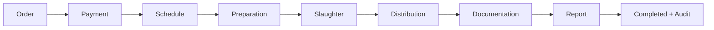
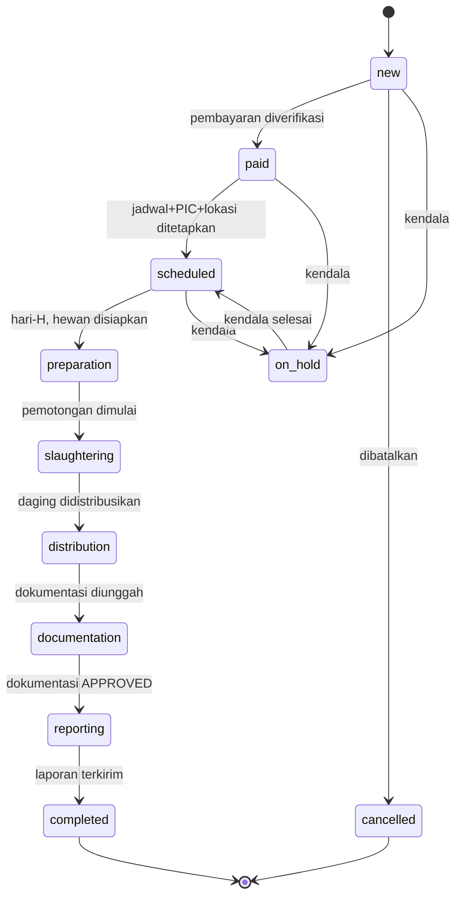
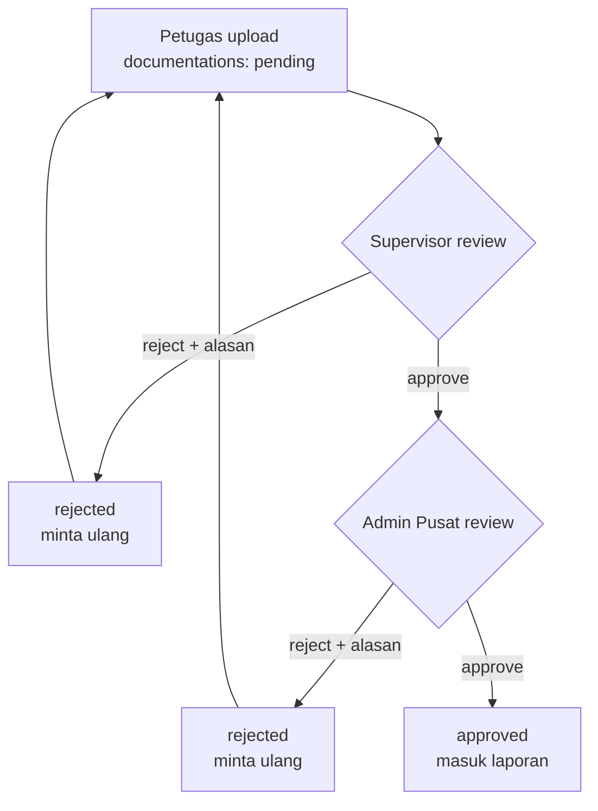
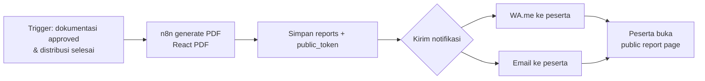
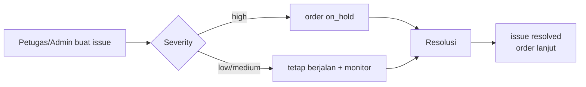

# 08 — WORKFLOW MAP

> **ImpactAqiqah** — *"Tunaikan Ibadah, Tebarkan Manfaat"*
> Status mengikuti `order_status` di **05_DATABASE_DESIGN §5**.

| Field | Value |
|-------|-------|
| Dokumen | 08_WORKFLOW_MAP |
| Versi | 1.0 |
| Tanggal | 2026-06-14 |
| Status | Draft — menunggu approval |

---

## 1. Alur End-to-End

## 2. Order State Machine

**Aturan transisi kunci:**
- `new → paid` butuh `payment_status = paid` **atau** `partial` dengan terbayar ≥ **`min_dp`** (DP/Partial diizinkan; `min_dp` dikonfigurasi di settings, default mis. 50%).
- `paid → scheduled` butuh `schedules` lengkap (tanggal, lokasi, PIC).
- **Pelunasan penuh** (`payment_status = paid`) wajib sebelum `reporting → completed`.
- `documentation → reporting` butuh ≥1 dokumentasi berstatus `approved`.
- `reporting → completed` butuh `reports` ter-generate & terkirim.
- `on_hold` dapat dipicu dari `issues` severity tinggi; kembali ke status sebelumnya saat resolved.

## 3. Workflow per Tahap (aktor, aksi, output, SLA)

| Tahap | Aktor | Aksi | Output/Status | SLA contoh |
|-------|-------|------|---------------|-----------|
| **Order** | Admin Cabang | Input order, item, peserta | `orders.status=new`, order_number | saat order masuk |
| **Payment** | Admin Cabang | Verifikasi bukti (lunas/DP ≥ min_dp) | `payment_status`, `status=paid` | < 1×24 jam |
| **Schedule** | Admin Cabang | Set tanggal/lokasi/PIC | `schedules`, `status=scheduled` | ≥ H-1 |
| **Preparation** | Petugas | Cek kelayakan hewan | `animals.status=prepared`, `status=preparation` | hari-H |
| **Slaughter** | Petugas | Catat pemotongan | `slaughter_records`, `animals.status=slaughtered` | hari-H |
| **Distribution** | Petugas | Catat distribusi | `distributions`, `animals.status=distributed` | ≤ H+1 |
| **Documentation** | Petugas→Supervisor→Pusat | Upload & validasi | `documentations.status` naik ke `approved` | ≤ H+1 |
| **Report** | n8n/Manager | Generate & kirim | `reports` + link unik | ≤ H+2 |
| **Audit** | Sistem | Catat jejak | `audit_logs` | berkelanjutan |

## 4. Sub-Workflow: Validasi Dokumentasi

Detail lengkap → **10_DOCUMENTATION_FLOW**.

## 5. Sub-Workflow: Reporting & Notifikasi (otomatis)

Detail → **11_REPORTING_ENGINE** & **18_AUTOMATION_WORKFLOW**.

## 6. Sub-Workflow: Penanganan Kendala (Issue)

Issue terbuka **disorot di dashboard** sebagai bagian jawaban "apa kendalanya" (litmus test < 10 detik).

## 7. Reminder Otomatis (n8n)

| Reminder | Pemicu | Target |
|----------|--------|--------|
| Dokumentasi tertunda | Order `distribution`/`documentation` tanpa dokumentasi `approved` setelah SLA | Petugas + Supervisor |
| Distribusi tertunda | `slaughtered` tanpa `distributions` setelah SLA | Petugas + Admin |
| Laporan tertunda | `reporting` tanpa `reports` terkirim setelah SLA | Manager |

Detail → **18_AUTOMATION_WORKFLOW**.

## 8. Pemetaan ke Litmus Test

> *"Berapa order belum selesai, di lokasi mana, siapa PIC-nya, apa kendalanya?"*

| Pertanyaan | Sumber data |
|------------|-------------|
| Belum selesai | `orders.status ≠ completed/cancelled` |
| Lokasi mana | `schedules.location_id → locations` |
| Siapa PIC | `schedules.pic_user_id → users` |
| Apa kendalanya | `issues` (status open/in_progress) |

Disajikan oleh view `v_open_orders` (**05 §7**) di dashboard (**09**).

---

### Referensi silang
- Status & entity → **05_DATABASE_DESIGN**
- Modul → **06_MODULE_BREAKDOWN**
- Dokumentasi → **10_DOCUMENTATION_FLOW**
- Reporting → **11_REPORTING_ENGINE**
- Otomasi → **18_AUTOMATION_WORKFLOW**
