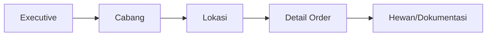

# 09 — DASHBOARD SPEC

> **ImpactAqiqah** — *"Tunaikan Ibadah, Tebarkan Manfaat"*
> Scope per role mengikuti **07_USER_ROLES**; sumber data dari views **05 §7**.

| Field | Value |
|-------|-------|
| Dokumen | 09_DASHBOARD_SPEC |
| Versi | 1.0 |
| Tanggal | 2026-06-14 |
| Status | Draft — menunggu approval |

---

## 1. Tujuan

Dashboard adalah **jantung monitoring**. Tujuan tunggal: menjawab *"Berapa order belum selesai, di lokasi mana, siapa PIC, apa kendalanya?"* dalam **< 10 detik**, dengan kemampuan drill-down dari agregat ke order individual.

**Prinsip:** muat cepat (< 3 dtk), real-time (Supabase Realtime), ter-scope RBAC, mobile-friendly.

## 2. KPI Inti (berlaku semua dashboard)

| KPI | Definisi | Sumber |
|-----|----------|--------|
| **Total Order** | Jumlah order pada periode/scope | `orders` |
| **Progress Potong** | % hewan `slaughtered`/`distributed` dari total | `animals`, `v_order_progress` |
| **Progress Distribusi** | % order dengan distribusi selesai | `distributions`, `v_order_progress` |
| **Progress Dokumentasi** | % order dengan dokumentasi `approved` | `documentations`, `v_order_progress` |
| **Progress Laporan** | % order dengan `reports` terkirim | `reports`, `v_order_progress` |
| **Order Tertunda** | Order `status ≠ completed/cancelled` | `v_open_orders` |
| **Issue Terbuka** | `issues` status open/in_progress | `issues` |

KPI sekunder: rata-rata waktu per tahap, order `on_hold`, SLA terlewat, beban per petugas.

## 3. Executive Dashboard (Direktur, Manager Program)

Scope: **semua cabang**.

```
┌───────────────────────────────────────────────────────────┐
│  ImpactAqiqah · Executive            [Periode ▾] [Cabang ▾]│
├──────────┬──────────┬──────────┬──────────┬───────────────┤
│ Total    │ Potong   │ Distrib. │ Dokumen. │ Laporan       │
│  1.240   │  82%     │  74%     │  68%     │  61%          │
├──────────┴──────────┴──────────┴──────────┴───────────────┤
│  Order Tertunda per Cabang (bar)   │  Issue Terbuka (list) │
│  ▇▇▇▇ Bandung 32                    │  ⚠ High: 4            │
│  ▇▇▇  Jakarta 21                    │  ⚠ Med: 11           │
│  ▇▇   Bekasi  9                     │                       │
├────────────────────────────────────┴───────────────────────┤
│  ▶ Tabel "Order Belum Selesai": No · Cabang · Lokasi · PIC  │
│    · Status · Issue · Umur   (klik → detail order)          │
└─────────────────────────────────────────────────────────────┘
```

Komponen: 5 KPI card, bar progres per cabang, panel issue, **tabel order tertunda (litmus test)**, tren waktu. Phase 2: AI Executive Summary & Risk (**19**).

## 4. Cabang Dashboard (Admin Cabang)

Scope: **1 cabang** (`branch_id`).
- 5 KPI card untuk cabangnya.
- Daftar order aktif per tahap (kanban ringkas: Paid → Scheduled → Slaughter → Distribution → Documentation → Reporting).
- Jadwal hari ini & mendatang (per lokasi/PIC).
- Antrian validasi dokumentasi tingkat-1.
- Issue cabang.

## 4b. Panel Validasi Pusat (Admin Pusat)

Scope: **semua cabang**, fokus mutu dokumentasi.
- **Antrian validasi tingkat-akhir** (`approved_supervisor`) lintas cabang.
- Aksi Approve (→ `approved`) / Reject (+alasan) massal & per item.
- Sorotan dokumentasi tertunda melewati SLA.
- Tautan ke generate laporan setelah dokumentasi final.

## 5. Lokasi Dashboard

Scope: **per lokasi** (drill-down dari cabang).
- Order terjadwal di lokasi + peta (Google Maps marker).
- Progres potong/distribusi lokasi.
- Petugas yang bertugas + status tugasnya.

## 6. Petugas Dashboard (Petugas Lapangan)

Scope: **tugas yang ditugaskan (PIC)** — mobile-first.
```
┌─────────────────────────────┐
│ Tugas Saya · Hari Ini       │
├─────────────────────────────┤
│ ● Order IA-202606-0012      │
│   Lokasi: Masjid Al-Ikhlas  │
│   2/3 hewan dipotong        │
│   [Potong] [Distribusi]     │
│   [📷 Upload Dokumentasi]   │
├─────────────────────────────┤
│ ○ Order IA-202606-0019  …   │
└─────────────────────────────┘
```
- Daftar tugas + status ringkas.
- Tombol aksi cepat: catat potong, catat distribusi, upload dokumentasi (kamera), lapor issue.
- Indikator upload pending (offline queue).

## 7. Interaksi & Drill-down


Setiap KPI card & baris tabel dapat diklik untuk turun satu level. Filter global: periode, cabang, lokasi, jenis layanan, status, PIC.

## 8. Real-time & Performa

- **Realtime:** perubahan status & dokumentasi mem-push update via Supabase Realtime.
- **Agregasi:** KPI dari SQL/materialized views (`v_order_progress`, `v_branch_kpi`, `v_open_orders`) agar query cepat.
- **Caching:** Server Components + revalidasi; data sensitif tetap ter-RLS.
- **Target:** initial paint < 3 dtk; jawaban litmus test < 10 dtk.

## 9. Pemetaan KPI → Sumber (ringkas)

| Dashboard | View utama |
|-----------|-----------|
| Executive | `v_branch_kpi`, `v_open_orders` |
| Cabang | `v_branch_kpi` (filter branch), `v_order_progress` |
| Lokasi | `v_order_progress` (filter location), `schedules` |
| Petugas | `schedules` (pic), `v_order_progress` |

---

### Referensi silang
- Views & entity → **05_DATABASE_DESIGN**
- Role/scope → **07_USER_ROLES**
- UI/komponen → **14_UI_UX_SPEC**
- AI summary/risk → **19_AI_LAYER**
