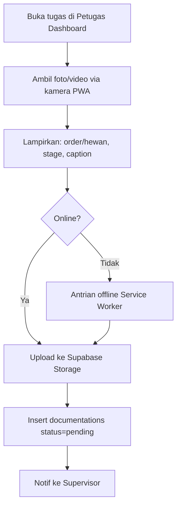
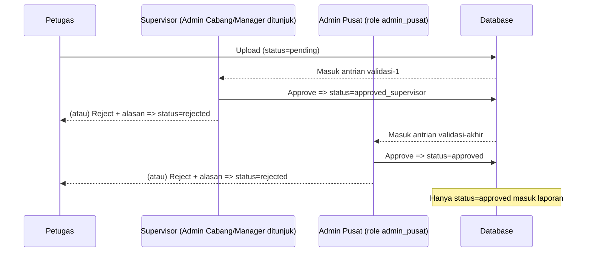

# 10 — DOCUMENTATION FLOW

> **ImpactAqiqah** — *"Tunaikan Ibadah, Tebarkan Manfaat"*
> Entity: `documentations` (**05**); status: `pending → approved_supervisor → approved` / `rejected`.

| Field | Value |
|-------|-------|
| Dokumen | 10_DOCUMENTATION_FLOW |
| Versi | 1.0 |
| Tanggal | 2026-06-14 |
| Status | Draft — menunggu approval |

---

## 1. Tujuan

Memastikan setiap order memiliki **bukti pelaksanaan yang sah & terverifikasi** sebelum dilaporkan ke peserta. Tidak ada order `completed` tanpa dokumentasi `approved`.

## 2. Jenis Dokumentasi

| Type | Contoh | Tahap (`stage`) |
|------|--------|-----------------|
| `photo` | Foto hewan, proses potong, paket daging, penerima | slaughter / distribution / general |
| `video` | Klip singkat pemotongan/penyerahan | slaughter / distribution |
| `note` | Catatan kondisi, jumlah, kendala | general |

## 3. Alur Upload (Petugas)

**Ketentuan upload:**
- Maks ukuran & kompresi gambar di klien (lihat **17_STORAGE_STRATEGY**).
- Penamaan & path file terstruktur (**17**).
- Metadata wajib: `order_id`, `stage`; `animal_id` bila relevan.
- Offline-tolerant: unggahan tertahan diberi indikator "pending upload".

## 4. Alur Validasi 2 Tingkat

**Aturan validasi:**
- Tingkat-1 oleh **Supervisor** (Admin Cabang/Manager yang ditunjuk); tingkat-akhir oleh **Admin Pusat** (`admin_pusat`).
- Reject **wajib** menyertakan alasan (`review_note`); item kembali untuk diperbaiki/ulang.
- `reviewed_by` & waktu tercatat di setiap langkah → `audit_logs`.
- **Pemisahan tugas:** pengupload (Petugas) ≠ validator-1 (Supervisor) ≠ validator akhir (Admin Pusat) (lihat **07**).
- Order baru bisa naik ke `reporting` jika dokumentasi minimum per tahap berstatus `approved`.

## 5. Aturan Kelengkapan Minimum (gate ke laporan)

| Tahap | Dokumentasi minimum |
|-------|---------------------|
| Slaughter | **≥ 1 foto/video proses pemotongan per ORDER** |
| Distribution | **≥ 1 foto penyerahan/penerima per ORDER** |
| General/Catatan | opsional, dianjurkan |

> **Kebijakan baku: minimum dihitung per ORDER** (bukan per hewan) agar praktis di lapangan & beban upload ringan. Bukti per hewan tetap dianjurkan namun tidak wajib. Aturan minimum dapat dikonfigurasi per jenis layanan (master `services`).

## 6. Status & Antrian

| Status | Arti | Terlihat di laporan? |
|--------|------|----------------------|
| `pending` | Menunggu validasi-1 | Tidak |
| `approved_supervisor` | Lolos validasi-1, menunggu pusat | Tidak |
| `approved` | Tervalidasi penuh | **Ya** |
| `rejected` | Ditolak (ada alasan) | Tidak |

Antrian validasi ditampilkan di **Cabang Dashboard** (tingkat-1) dan panel pusat (tingkat-akhir).

## 7. Notifikasi terkait (lihat **12**)

- Upload baru → notif ke Supervisor.
- Reject → notif ke Petugas (perbaiki).
- Semua `approved` & distribusi selesai → memicu **Reporting** (**11**, **18**).
- Reminder otomatis bila dokumentasi tertunda melewati SLA (**18**).

## 8. Privasi & Keamanan

- Media diakses via **signed URL** terbatas waktu; tidak ada URL publik permanen kecuali yang sengaja disertakan di laporan ber-token.
- Akses upload/validasi ter-scope RBAC (**07**, **20**).

---

### Referensi silang
- Entity → **05_DATABASE_DESIGN**
- Storage/naming → **17_STORAGE_STRATEGY**
- PWA/kamera/offline → **13_PWA_ARCHITECTURE**
- Reporting → **11_REPORTING_ENGINE**
- Otomasi/reminder → **18_AUTOMATION_WORKFLOW**
