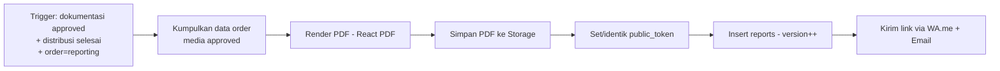

# 11 — REPORTING ENGINE

> **ImpactAqiqah** — *"Tunaikan Ibadah, Tebarkan Manfaat"*
> Entity: `reports`, `orders.public_token` (**05**). Render: React PDF.

| Field | Value |
|-------|-------|
| Dokumen | 11_REPORTING_ENGINE |
| Versi | 1.0 |
| Tanggal | 2026-06-14 |
| Status | Draft — menunggu approval |

---

## 1. Tujuan

Menghasilkan **laporan peserta** transparan secara otomatis dan membagikannya via **link unik tanpa login**. Peserta cukup membuka tautan untuk melihat & mengunduh bukti ibadahnya.

## 2. Output

| Output | Bentuk | Akses |
|--------|--------|-------|
| **PDF Report** | File PDF (React PDF) di Storage | Diunduh dari halaman publik |
| **Public Report Page** | Halaman web read-only Next.js | Via link unik bertoken, tanpa login |
| **Shareable Link** | URL `…/r/{public_token}` | Dikirim via WA.me/Email |
| **Download Report** | Tombol unduh PDF di halaman publik | Signed URL |

## 3. Isi Laporan

1. **Header** — logo, judul, nomor order, jenis layanan, tanggal.
2. **Ringkasan** — peserta (atas nama), jumlah & jenis hewan, lokasi, tanggal pelaksanaan.
3. **Status pelaksanaan** — potong & distribusi (selesai/jumlah paket).
4. **Galeri bukti** — foto/video **`approved`** saja (dari **10**).
5. **Catatan distribusi** — area/penerima, jumlah paket.
6. **Penutup** — ucapan terima kasih, kontak Zakat Sukses, QR ke halaman publik.

> Hanya dokumentasi berstatus `approved` yang muncul. Data peserta lain tidak pernah ditampilkan.

## 4. Alur Generate (otomatis via n8n)



- **Idempoten:** generate ulang membuat `version` baru tanpa menggandakan token.
- Bisa dipicu otomatis (n8n) atau manual (Manager/Admin).
- Detail orkestrasi → **18_AUTOMATION_WORKFLOW**.

## 5. Public Report Page (tanpa login)

- Route: `GET /r/{public_token}` (lihat **15**, **16**).
- **Token** = string acak panjang & tak tertebak (disimpan di `orders.public_token` / `reports.public_token`).
- Server memvalidasi token → mengambil data order terkait **saja**.
- Media dirender via **signed URL** terbatas waktu (bukan path mentah).
- Halaman **read-only**, responsif, ringan; tombol **Unduh PDF**.
- Tidak ada enumerasi: token panjang + rate limiting (lihat **20**).

```
┌──────────────────────────────────────────┐
│  ImpactAqiqah · Laporan Pelaksanaan       │
│  Order IA-202606-0012 · Aqiqah            │
├──────────────────────────────────────────┤
│  Atas nama : Ahmad                        │
│  Hewan     : 1 Kambing                    │
│  Lokasi    : Masjid Al-Ikhlas, Bandung    │
│  Tanggal   : 12 Jun 2026                  │
│  Status    : ✅ Dipotong  ✅ Distribusi   │
├──────────────────────────────────────────┤
│  [Foto] [Foto] [Video] … (approved)       │
├──────────────────────────────────────────┤
│  Distribusi: 8 paket — area Cibiru        │
│  [⬇ Unduh PDF]                            │
└──────────────────────────────────────────┘
```

## 6. Keamanan Akses

| Aspek | Aturan |
|-------|--------|
| Otentikasi | Tidak perlu; akses berbasis kepemilikan token. |
| Token | Panjang, acak, unik per order; dapat dirotasi bila bocor. |
| Media | Signed URL kedaluwarsa; tidak ada listing publik. |
| Rate limit | Batasi percobaan token tidak valid. |
| Data minimal | Hanya tampilkan data order pemilik token. |

Detail → **20_SECURITY_CHECKLIST**.

## 7. Versi & Audit

- Setiap generate menambah `reports.version`; PDF lama tetap tersimpan untuk audit.
- Aksi generate/kirim tercatat di `audit_logs` & outbox `notifications`.

---

### Referensi silang
- Entity → **05_DATABASE_DESIGN**
- Sumber media → **10_DOCUMENTATION_FLOW**
- Pengiriman → **12_NOTIFICATION_SYSTEM**
- Otomasi → **18_AUTOMATION_WORKFLOW**
- Keamanan → **20_SECURITY_CHECKLIST**
- Storage → **17_STORAGE_STRATEGY**
