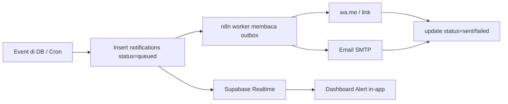

# 12 — NOTIFICATION SYSTEM

> **ImpactAqiqah** — *"Tunaikan Ibadah, Tebarkan Manfaat"*
> Entity: `notifications` (channel `whatsapp`/`email`/`dashboard`, status `queued`/`sent`/`failed`).

| Field | Value |
|-------|-------|
| Dokumen | 12_NOTIFICATION_SYSTEM |
| Versi | 1.0 |
| Tanggal | 2026-06-14 |
| Status | Draft — menunggu approval |

---

## 1. Tujuan

Memastikan informasi penting sampai ke pihak yang tepat: peserta menerima laporan, petugas/supervisor diingatkan tugas, manajemen disorot kendala.

## 2. Kanal

| Kanal | Implementasi MVP | Penggunaan |
|-------|------------------|------------|
| **WhatsApp** | Tautan **wa.me** (klik untuk kirim, atau template terisi) | Kirim link laporan ke peserta; reminder ke petugas |
| **Email** | SMTP/transactional dipicu n8n | Kirim link laporan; ringkasan; reminder |
| **Dashboard Alert** | In-app (Realtime + tabel `notifications`) | Tugas baru, validasi, keterlambatan, issue |

> Catatan: MVP memakai **wa.me** (bukan WhatsApp Business API). Upgrade ke WA Business API masuk Phase 2 bila diperlukan.

## 3. Katalog Notifikasi

| Event | Kanal | Target | Pemicu |
|-------|-------|--------|--------|
| Order dijadwalkan | Dashboard | Petugas (PIC) | `status=scheduled` |
| Tugas hari-H | Dashboard, (WA) | Petugas | cron H-0 |
| Dokumentasi diupload | Dashboard | Supervisor | insert `documentations` |
| Dokumentasi ditolak | Dashboard, (WA) | Petugas | `status=rejected` |
| Validasi akhir diperlukan | Dashboard | Admin Pusat | `status=approved_supervisor` |
| Laporan siap | **WA + Email** | Peserta | `reports` ter-generate |
| Reminder dokumentasi tertunda | Dashboard, WA | Petugas + Supervisor | SLA terlewat (n8n) |
| Reminder distribusi tertunda | Dashboard, WA | Petugas + Admin | SLA terlewat (n8n) |
| Reminder laporan tertunda | Dashboard, Email | Manager | SLA terlewat (n8n) |
| Issue severity high | Dashboard, WA | Manager + Admin | insert `issues` high |

## 4. Arsitektur (outbox pattern)



**Prinsip:**
- **Outbox** `notifications` sebagai antrian tunggal — andal & auditable.
- n8n memproses kanal keluar (WA/email), memperbarui status, retry bila `failed`.
- Dashboard alert dibaca langsung dari outbox via Realtime.
- Idempotensi: hindari kirim ganda dengan kunci event.

## 5. Template Pesan (contoh)

**WA — Laporan siap (ke peserta):**
```
Assalamu'alaikum {nama}. Alhamdulillah ibadah {layanan} Anda
(Order {order_number}) telah dilaksanakan. Lihat laporan & dokumentasi:
{link_publik}
— Zakat Sukses · ImpactAqiqah
```

**WA — Reminder dokumentasi (ke petugas):**
```
Reminder: Order {order_number} di {lokasi} belum lengkap dokumentasinya.
Mohon upload bukti hari ini. Buka: {link_tugas}
```

**Email — Laporan siap:** subjek "Laporan {layanan} Anda — {order_number}", body berisi ringkasan + tombol link publik + lampiran/atau link PDF.

## 6. Preferensi & Kepatuhan

- Kirim hanya ke kontak yang tercatat di order/peserta.
- Hormati jam wajar pengiriman (hindari tengah malam) — diatur di n8n.
- Catat semua pengiriman di `notifications` (audit).
- Data kontak diperlakukan privat (**20**).

---

### Referensi silang
- Entity → **05_DATABASE_DESIGN**
- Reminder & cron → **18_AUTOMATION_WORKFLOW**
- Laporan/link → **11_REPORTING_ENGINE**
- Keamanan/privasi → **20_SECURITY_CHECKLIST**
