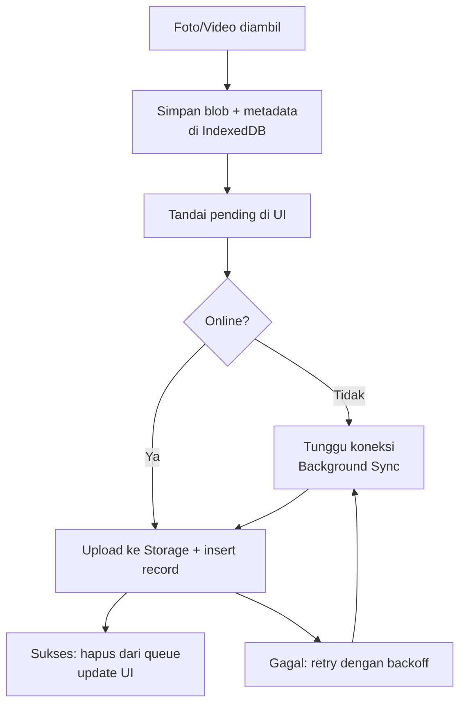
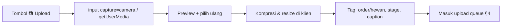

# 13 — PWA ARCHITECTURE

> **ImpactAqiqah** — *"Tunaikan Ibadah, Tebarkan Manfaat"*
> Mendukung NFR-4 (mobile, offline-tolerant) & FR-D6 (upload tahan sinyal buruk).

| Field | Value |
|-------|-------|
| Dokumen | 13_PWA_ARCHITECTURE |
| Versi | 1.0 |
| Tanggal | 2026-06-14 |
| Status | Draft — menunggu approval |

---

## 1. Mengapa PWA (bukan native)

Petugas lapangan butuh kamera & akses cepat tanpa hambatan install dari app store. PWA: instalable, ringan, satu basis kode (Next.js 16), update instan, dan mendukung offline untuk skenario sinyal lemah. Native app **non-scope** (lihat **01 §6**).

## 2. Manifest (Web App Manifest)

```json
{
  "name": "ImpactAqiqah",
  "short_name": "ImpactAqiqah",
  "description": "Operations Command Center — Aqiqah, Qurban, Sedekah Daging",
  "start_url": "/dashboard",
  "scope": "/",
  "display": "standalone",
  "orientation": "portrait",
  "background_color": "#ffffff",
  "theme_color": "#0E7C5A",
  "icons": [
    { "src": "/icons/icon-192.png", "sizes": "192x192", "type": "image/png" },
    { "src": "/icons/icon-512.png", "sizes": "512x512", "type": "image/png" },
    { "src": "/icons/maskable-512.png", "sizes": "512x512", "type": "image/png", "purpose": "maskable" }
  ]
}
```
> `theme_color` mengikuti palet primer di **14_UI_UX_SPEC**.

## 3. Service Worker & Caching

| Aset | Strategi |
|------|----------|
| App shell (HTML/CSS/JS) | Precache + Stale-While-Revalidate |
| Data dashboard (API) | Network-first dengan fallback cache singkat |
| Media (foto/video laporan) | Cache-on-demand (read), tidak untuk data sensitif |
| Upload dokumentasi | **Background Sync / antrian persisten** (lihat §4) |

- Service worker via library yang kompatibel Next.js 16 (mis. Serwist/Workbox) atau implementasi kustom.
- Halaman publik laporan (`/r/{token}`) tidak di-precache (selalu fresh & ter-token).

## 4. Offline Strategy — Upload Queue



**Ketentuan:**
- Antrian disimpan di **IndexedDB** (tahan reload/kehilangan koneksi).
- Indikator jelas: jumlah item pending, status retry.
- Retry dengan exponential backoff; idempotensi agar tak menggandakan.
- Operasi read dashboard boleh memakai cache terakhir saat offline (ditandai "data mungkin tertunda").

## 5. Mobile UX (prinsip)

- **Mobile-first**, target sentuh ≥ 44px, aksi utama dalam jangkauan ibu jari.
- Navigasi bawah untuk petugas: Tugas · Upload · Profil.
- Aksi cepat 1-tap: Catat Potong, Catat Distribusi, Upload, Lapor Issue.
- Form ringkas dengan default cerdas & validasi inline.
- Hemat data: kompresi gambar sebelum upload.
- Detail visual & komponen → **14_UI_UX_SPEC**.

## 6. Camera Upload Flow



- Gunakan `<input type="file" accept="image/*,video/*" capture="environment">` untuk kompatibilitas luas; opsi `getUserMedia` untuk capture in-app.
- Kompresi/resize klien menekan ukuran (lihat batas di **17**).
- EXIF lokasi opsional dilucuti/diatur sesuai kebijakan privasi (**20**).

## 7. Instalasi & Update

- Prompt "Tambah ke Layar Utama" pada perangkat yang mendukung.
- Update otomatis saat versi baru terdeteksi (skip-waiting terkontrol + notifikasi "muat ulang untuk update").

## 8. Batasan

- Fitur sensitif (mutasi data) tetap memerlukan koneksi saat sinkron; offline hanya menahan & antri.
- Push notification OS bersifat opsional Phase 2; MVP mengandalkan dashboard alert + WA/email.

---

### Referensi silang
- UI/komponen → **14_UI_UX_SPEC**
- Upload & validasi → **10_DOCUMENTATION_FLOW**
- Batas file & naming → **17_STORAGE_STRATEGY**
- Keamanan → **20_SECURITY_CHECKLIST**
