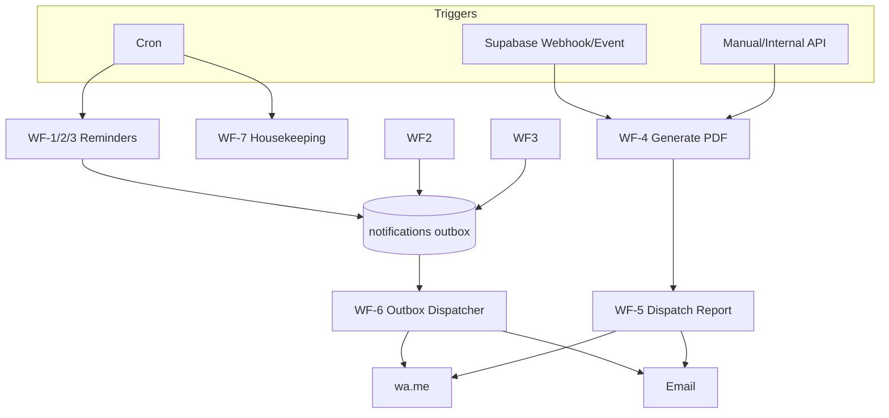

# 18 — AUTOMATION WORKFLOW (n8n)

> **ImpactAqiqah** — *"Tunaikan Ibadah, Tebarkan Manfaat"*
> Otomasi memakai **n8n**; outbox `notifications` & event status dari **05**/**08**.

| Field | Value |
|-------|-------|
| Dokumen | 18_AUTOMATION_WORKFLOW |
| Versi | 1.0 |
| Tanggal | 2026-06-14 |
| Status | Draft — menunggu approval |

---

## 1. Peran n8n

n8n menangani pekerjaan **asinkron & terjadwal** agar app tetap ringan:
- Reminder (dokumentasi, distribusi, laporan).
- Generate PDF laporan & set link publik.
- Kirim notifikasi keluar (WA.me/Email) via outbox.
- Pembersihan storage terjadwal (**17**).

## 2. Pola Pemicu

| Pola | Mekanisme |
|------|-----------|
| **Event-driven** | Supabase webhook / DB trigger → n8n webhook (mis. `documentation approved`, `order=reporting`). |
| **Scheduled (cron)** | Jadwal berkala untuk reminder & housekeeping. |
| **Manual** | Endpoint internal dipicu Manager/Admin (mis. generate ulang laporan). |

## 3. Daftar Workflow

### WF-1 — Reminder Dokumentasi
- **Trigger:** cron tiap jam kerja.
- **Logika:** cari order `distribution`/`documentation` tanpa dokumentasi `approved` melewati SLA.
- **Aksi:** insert `notifications` (dashboard + WA) ke Petugas & Supervisor.

### WF-2 — Reminder Distribusi
- **Trigger:** cron harian.
- **Logika:** hewan `slaughtered` tanpa `distributions` melewati SLA.
- **Aksi:** notif Petugas + Admin.

### WF-3 — Reminder Laporan
- **Trigger:** cron harian.
- **Logika:** order `reporting` tanpa `reports` terkirim melewati SLA.
- **Aksi:** notif Manager (dashboard + email).

### WF-4 — Generate PDF Report
- **Trigger:** event `documentation approved` + distribusi selesai + order `reporting` (atau manual).
- **Logika:** kumpulkan data + media `approved` → render PDF (React PDF service) → simpan ke bucket `reports` → upsert `reports` (version++) + pastikan `public_token`.
- **Idempoten:** token tetap; versi bertambah.

### WF-5 — Email/WA Report Dispatch
- **Trigger:** setelah WF-4 sukses, atau outbox `notifications status=queued` channel WA/email.
- **Logika:** ambil kontak peserta → kirim link publik → update `notifications.status=sent/failed` (retry backoff).

### WF-6 — Outbox Dispatcher (umum)
- **Trigger:** cron singkat / webhook saat insert outbox.
- **Logika:** proses semua `notifications queued`, kirim per channel, tandai hasil. Mencegah kirim ganda via kunci event.

### WF-7 — Storage Housekeeping
- **Trigger:** cron harian/mingguan.
- **Logika:** hapus file orphan (>7 hari) & dokumentasi `rejected`/`pending` lama (>90 hari) sesuai retensi (**17**); catat ke `audit_logs`.

### WF-8 — (Phase 2) AI Jobs
- Memicu AI Executive Summary / Risk Detector / Report Writer (**19**) terjadwal atau on-demand.

## 4. Diagram Orkestrasi

## 5. Konfigurasi & Keandalan

| Aspek | Ketentuan |
|-------|-----------|
| Kredensial | Service key Supabase & SMTP disimpan di credential store n8n (bukan hardcode). |
| Idempotensi | Kunci event/`order_id+versi` mencegah duplikasi. |
| Retry | Backoff untuk kegagalan kirim; batas percobaan lalu `failed` + alert. |
| SLA config | Ambang reminder dikonfigurasi (mis. per jenis layanan). |
| Audit | Setiap aksi penting menulis `audit_logs`/update outbox. |
| Keamanan | Webhook n8n diproteksi secret; akses minimal (**20**). |
| Observability | Log eksekusi n8n dipantau; kegagalan memunculkan dashboard alert. |

## 6. Lingkungan

- n8n berjalan terpisah (self-host/managed) dan mengakses Supabase via API.
- Konfigurasi env dev/staging/prod terpisah (**22**).

---

### Referensi silang
- Outbox & event → **12_NOTIFICATION_SYSTEM**
- Laporan → **11_REPORTING_ENGINE**
- Workflow/status → **08_WORKFLOW_MAP**
- Retensi storage → **17_STORAGE_STRATEGY**
- AI jobs → **19_AI_LAYER**
- Deployment → **22_DEPLOYMENT_PLAN**
