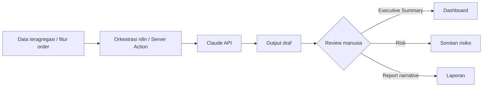

# 19 — AI LAYER

> **ImpactAqiqah** — *"Tunaikan Ibadah, Tebarkan Manfaat"*
> **Phase 2.** Hanya 3 use case bernilai bisnis nyata. Tanpa AI yang tidak memberi nilai.

| Field | Value |
|-------|-------|
| Dokumen | 19_AI_LAYER |
| Versi | 1.0 |
| Tanggal | 2026-06-14 |
| Status | Draft — menunggu approval |
| Fase | Phase 2 (setelah MVP stabil) |

---

## 1. Prinsip

- AI **melapisi** sistem operasional, bukan menggantikannya. MVP harus jalan tanpa AI.
- Hanya fitur yang menghemat waktu manajemen atau mencegah kegagalan operasional.
- **Human-in-the-loop:** output AI adalah draf/sinyal, keputusan tetap di manusia.
- **Privasi:** kirim data minimal & teragregasi; tidak ada data pribadi peserta yang tidak perlu.
- Model: **Claude API** (default model Claude terbaru, mis. Opus/Sonnet sesuai kebutuhan biaya/kualitas).

## 2. AI Executive Summary

- **Nilai:** ringkas kondisi operasional untuk Direktur/Manager dalam bahasa natural.
- **Input:** KPI agregat dari views (`v_branch_kpi`, `v_open_orders`, `v_order_progress`) — **angka, bukan data pribadi**.
- **Output:** paragraf ringkas: total order, progres potong/distribusi/dokumentasi/laporan, sorotan cabang tertinggal, jumlah issue.
- **Pemicu:** terjadwal (mis. ringkasan harian) atau on-demand di Executive Dashboard.
- **Contoh output:**
  > "Per 14 Jun, 1.240 order: 82% terpotong, 74% terdistribusi. Cabang Bandung tertinggal pada dokumentasi (60%) dengan 32 order tertunda & 4 issue high. Prioritaskan validasi dokumentasi Bandung."

## 3. AI Risk Detector

- **Nilai:** menandai order **berisiko telat/bermasalah** lebih awal.
- **Input:** fitur operasional per order — umur di status, SLA terlewat, dokumentasi belum `approved`, issue terbuka, beban PIC, kedekatan tanggal pelaksanaan.
- **Output:** skor/risiko (low/medium/high) + alasan singkat, ditampilkan sebagai sorotan di dashboard.
- **Pemicu:** terjadwal (n8n WF-8) atau saat dashboard dibuka.
- **Catatan:** memperkuat litmus test ("apa kendalanya") dengan prediksi, bukan hanya status saat ini.

## 4. AI Report Writer

- **Nilai:** menyusun **narasi laporan peserta** otomatis & konsisten.
- **Input:** data order + ringkasan pelaksanaan + jumlah distribusi (tanpa menyimpulkan dari foto secara klaim sensitif).
- **Output:** paragraf narasi untuk dimasukkan ke PDF/halaman publik (**11**); **wajib direview** sebelum dikirim (human-in-the-loop, opsional auto untuk template terstandar).
- **Pemicu:** saat generate laporan (WF-4) sebagai langkah opsional.

## 5. Arsitektur Integrasi

- Pemanggilan via server (kunci API rahasia, tidak di klien).
- Prompt menyertakan instruksi format & batasan; output divalidasi sebelum dipakai.
- Biaya dikontrol: batasi frekuensi, gunakan data ringkas, cache hasil bila relevan.

## 6. Guardrails

| Aspek | Aturan |
|-------|--------|
| Akurasi | Output = bantuan, bukan kebenaran final; tandai "draf AI". |
| Privasi | Minimalkan PII; kirim agregat bila cukup (**20**). |
| Keamanan | API key di server/secret store; audit pemanggilan. |
| Biaya | Frekuensi terjadwal & rate-limit; pilih model sesuai kebutuhan. |
| Fallback | Jika AI gagal/non-aktif, fitur inti tetap berjalan (summary manual, laporan template). |

## 7. Non-Goal AI (MVP & sekarang)

- Tidak ada chatbot umum, tidak ada auto-decision tanpa review, tidak ada analisis citra yang membuat klaim syariah/medis, tidak ada personalisasi marketing.

---

### Referensi silang
- KPI/views sumber → **05_DATABASE_DESIGN**, **09_DASHBOARD_SPEC**
- Orkestrasi → **18_AUTOMATION_WORKFLOW**
- Laporan → **11_REPORTING_ENGINE**
- Privasi/keamanan → **20_SECURITY_CHECKLIST**
- Roadmap fase → **23_MVP_ROADMAP**
