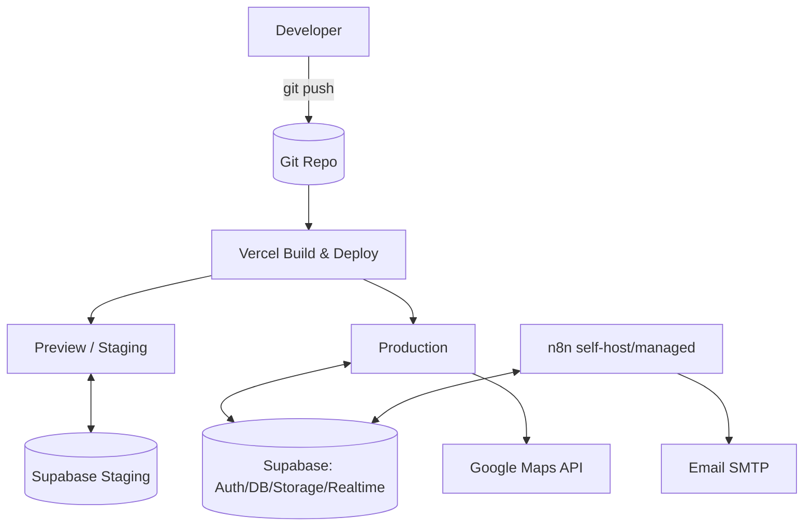
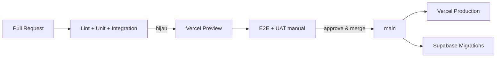

# 22 — DEPLOYMENT PLAN

> **ImpactAqiqah** — *"Tunaikan Ibadah, Tebarkan Manfaat"*

| Field | Value |
|-------|-------|
| Dokumen | 22_DEPLOYMENT_PLAN |
| Versi | 1.0 |
| Tanggal | 2026-06-14 |
| Status | Draft — menunggu approval |

---

## 1. Topologi

## 2. Komponen & Hosting

| Lapisan | Teknologi | Hosting |
|---------|-----------|---------|
| Frontend/PWA | **Next.js 16** | **Vercel** |
| Backend (Auth/DB/Storage/Realtime) | **Supabase** | Supabase Cloud |
| Database | **PostgreSQL** | Supabase |
| Storage media/PDF | **Supabase Storage** | Supabase |
| Automation | **n8n** | Self-host (VPS/container) atau n8n Cloud |
| PDF render | **React PDF** | Dalam app/serverless (atau dipicu n8n) |
| Maps | **Google Maps API** | Google Cloud |
| Notifikasi | wa.me + Email SMTP | Eksternal |

## 3. Environments

| Env | Tujuan | Supabase | Vercel |
|-----|--------|----------|--------|
| **Development** | Lokal | Project dev (atau Supabase local) | `vercel dev` / preview |
| **Staging** | UAT, uji performa/security | Project staging (data dummy) | Preview deployment |
| **Production** | Operasional | Project prod | Production deployment |

- Env vars terpisah per environment; **secrets di Vercel/Supabase/n8n secret store**, tidak di repo (**20**).
- Data prod tidak dipakai non-prod.

## 4. Konfigurasi & Secrets

| Secret | Lokasi |
|--------|--------|
| `NEXT_PUBLIC_SUPABASE_URL` / anon key | Env (anon aman dipublik, RLS melindungi) |
| Supabase **service role key** | Server-only env / n8n |
| Google Maps API key | Env (dibatasi domain) |
| SMTP / email | n8n credentials |
| Claude API key (Phase 2) | Server-only / n8n |
| n8n webhook secret | Env n8n & app |

## 5. CI/CD Pipeline

- **Migrations DB** dikelola sebagai kode (Supabase migrations) dan dijalankan terkontrol per environment (urutan: staging → prod).
- Gate merge: semua test wajib hijau (**21**).
- Rollback: Vercel instant rollback ke deployment sebelumnya; migrasi dibuat **backward-compatible** (expand/contract).

## 6. Database Migration Strategy

- Skema dari **05** diimplementasikan via migration berurutan + RLS policy + views (`v_order_progress`, `v_branch_kpi`, `v_open_orders`).
- Pola **expand → migrate → contract** agar zero-downtime.
- Seed master data (services, contoh cabang/lokasi) via seed script terpisah (non-prod).

## 7. Observability & Backup

| Aspek | Mekanisme |
|-------|-----------|
| Logs | Vercel logs + Supabase logs + n8n execution logs |
| Error monitoring | Integrasi error tracking (mis. Sentry) — opsional |
| Uptime | Health check route + monitor eksternal |
| Backup DB | Backup terjadwal Supabase; uji restore berkala |
| Backup Storage | Mengikuti kebijakan Supabase + housekeeping (**17/18**) |
| Alert | Kegagalan job n8n & error kritis → dashboard alert/email |

## 8. Release Plan

1. Provision Supabase (prod) + bucket + RLS + migrations.
2. Set env & secrets di Vercel & n8n.
3. Deploy app ke production.
4. Aktifkan workflow n8n (reminder/report/dispatch).
5. Pilot 1 cabang (UAT lapangan) → perbaikan → rollout bertahap.
6. Pantau KPI & error pasca-rilis.

## 9. Domain & PWA

- Domain produksi + HTTPS otomatis (Vercel).
- Manifest & service worker aktif (**13**); ikon & `theme_color` sesuai **14**.
- Cek instalable & offline shell sebelum rilis.

---

### Referensi silang
- Arsitektur → **04_SYSTEM_ARCHITECTURE**
- Skema/migrations → **05_DATABASE_DESIGN**
- Keamanan/secrets → **20_SECURITY_CHECKLIST**
- Testing/CI → **21_TESTING_PLAN**
- Otomasi → **18_AUTOMATION_WORKFLOW**
- Folder/struktur → **24_FOLDER_STRUCTURE**
