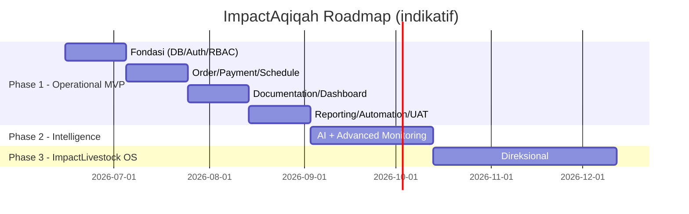

# 23 — MVP ROADMAP

> **ImpactAqiqah** — *"Tunaikan Ibadah, Tebarkan Manfaat"*

| Field | Value |
|-------|-------|
| Dokumen | 23_MVP_ROADMAP |
| Versi | 1.0 |
| Tanggal | 2026-06-14 |
| Status | Draft — menunggu approval |

---

## 1. Prinsip Roadmap

- **Operasional dulu**: Phase 1 menghasilkan sistem yang langsung dipakai (order → laporan).
- Tidak melompat fase sebelum fase sebelumnya **stabil** (sejalan **25_BUILD_SEQUENCE**).
- Setiap fase punya **exit criteria** yang terukur.

## 2. Phase 1 — Operational MVP

**Tujuan:** menjawab litmus test & menjalankan siklus order penuh secara digital.

| Modul | Cakupan |
|-------|---------|
| Auth & RBAC | Login, 6 role, RLS scoping |
| Order Management | CRUD order, state machine, filter |
| Payment | Catat & verifikasi manual |
| Scheduling | Tanggal/lokasi/PIC |
| Animal/Slaughter/Distribution | Catat pelaksanaan |
| **Documentation** | Upload (PWA/kamera, offline) + validasi 2 tingkat |
| **Dashboard** | Executive/Cabang/Lokasi/Petugas + KPI |
| **Reporting** | PDF + halaman publik bertoken + kirim WA/Email |
| Notification | Dashboard alert + WA.me/Email |
| Automation (dasar) | Reminder + generate/kirim laporan (n8n) |
| Audit Trail | Log perubahan penting |

**Exit criteria Phase 1:**
- [ ] Litmus test terjawab < 10 dtk di dashboard.
- [ ] 1 cabang pilot menjalankan order → laporan end-to-end.
- [ ] ≥ 95% order selesai punya dokumentasi tervalidasi.
- [ ] Laporan peserta terkirim otomatis via link unik.
- [ ] Lulus UAT & checklist keamanan inti (**20/21**).

## 3. Phase 2 — Intelligence & Advanced Monitoring

**Tujuan:** menambah lapisan cerdas & pemantauan lanjutan **setelah** operasional stabil.

| Fitur | Deskripsi |
|-------|-----------|
| **AI Executive Summary** | Ringkasan KPI naratif (**19**) |
| **AI Risk Detector** | Deteksi order berisiko telat/bermasalah |
| **AI Report Writer** | Narasi laporan otomatis (review manusia) |
| Advanced Monitoring | Tren, SLA analytics, beban petugas, alert proaktif |
| **Distribution Intelligence** | Optimasi & visibilitas distribusi (peta, area, rekap penerima) |
| Notifikasi lanjutan | (Opsi) WhatsApp Business API, push OS |

**Exit criteria Phase 2:**
- [ ] AI memberi nilai nyata (dipakai manajemen, mengurangi waktu/insiden).
- [ ] Monitoring lanjutan menurunkan order telat.
- [ ] Tidak mengganggu kestabilan Phase 1.

## 4. Phase 3 — ImpactLivestock OS

**Tujuan:** evolusi menjadi platform operasi ternak yang lebih luas (visi jangka panjang).

| Arah | Deskripsi |
|------|-----------|
| Manajemen ternak end-to-end | Siklus hidup hewan, stok, mitra peternak |
| Supply & sourcing | Visibilitas pasokan hewan |
| Ekspansi modul | Integrasi keuangan/logistik bila dibutuhkan |
| Skala organisasi | Banyak cabang/program dengan analitik lintas-program |

> Ruang lingkup Phase 3 akan dirinci ulang setelah Phase 1–2 berjalan; saat ini bersifat direksional.

## 5. Timeline (indikatif)

> Durasi indikatif; disesuaikan kapasitas tim. Urutan teknis mengikuti **25_BUILD_SEQUENCE**.

## 6. Out of Scope (tetap)

Native app, multi-tenant SaaS, marketplace/checkout, payment gateway penuh, akuntansi penuh — sesuai **01 §6** (dapat ditinjau ulang di fase lanjut bila ada kebutuhan bisnis jelas).

---

### Referensi silang
- Scope/non-scope → **01_PROJECT_VISION**
- Urutan build → **25_BUILD_SEQUENCE**
- AI → **19_AI_LAYER**
- Testing/exit → **21_TESTING_PLAN**
