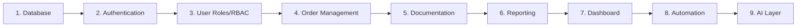

# 25 — BUILD SEQUENCE

> **ImpactAqiqah** — *"Tunaikan Ibadah, Tebarkan Manfaat"*
> Urutan pembangunan sistem. **Dilarang melompat** ke tahap berikutnya sebelum tahap sebelumnya stabil.

| Field | Value |
|-------|-------|
| Dokumen | 25_BUILD_SEQUENCE |
| Versi | 1.0 |
| Tanggal | 2026-06-14 |
| Status | Draft — menunggu approval |

---

## 1. Urutan Tahap

> Catatan: Payment, Scheduling, Slaughter, Distribution dibangun **bersama Order Management** (tahap 4) karena merupakan rangkaian status order (**08**). Dokumentasi dipisah (tahap 5) karena menjadi gate menuju laporan.

## 2. Detail per Tahap

### Tahap 1 — Database
- Implementasi skema **05** via Supabase migrations: tabel, enum, relasi, index, views (`v_order_progress`, `v_branch_kpi`, `v_open_orders`).
- Aktifkan RLS (kebijakan dasar) & seed master data non-prod.
- **Exit:** migrasi jalan di dev/staging; views mengembalikan data; index terpasang.

### Tahap 2 — Authentication
- Supabase Auth: login/logout, sesi, profil (`users`).
- Guard route `(app)/*`; redirect `/login`.
- **Exit:** user dapat login; sesi aman; `/me` mengembalikan profil+role.

### Tahap 3 — User Roles / RBAC
- Klaim `role` & `branch_id`; **RLS** scoping per cabang (**07/20**).
- Capability checks di Server Actions (defense in depth).
- **Exit:** uji RLS positif/negatif hijau (lintas cabang & role).

### Tahap 4 — Order Management (inti operasional)
- Order CRUD + `order_number`; **state machine** (**08**) via endpoint `/status`.
- Sub-modul status: **Payment** (verifikasi), **Scheduling** (tanggal/lokasi/PIC), **Animal/Slaughter/Distribution** (catat pelaksanaan), **Issues**.
- Audit trail untuk perubahan status.
- **Exit:** order dapat berjalan New → Distribution; filter & timeline jalan; transisi tervalidasi.

### Tahap 5 — Documentation
- Upload PWA/kamera + offline queue (**13**); record `documentations`.
- Validasi 2 tingkat (Supervisor → Pusat); gate ke `reporting` (**10**).
- Storage private + signed URL + naming (**17**).
- **Exit:** dokumentasi `approved` mengangkat order ke `reporting`; offline upload tersinkron.

### Tahap 6 — Reporting
- Generate PDF (React PDF) + `public_token`; halaman publik `/r/{token}` (**11**).
- Unduh PDF via signed URL; anti-enumerasi & rate limit (**20**).
- **Exit:** peserta membuka laporan via link & mengunduh PDF; hanya media approved tampil.

### Tahap 7 — Dashboard
- Executive/Cabang/Lokasi/Petugas + KPI dari views; Realtime (**09**).
- **Litmus test < 10 dtk** (`v_open_orders`).
- **Exit:** semua dashboard ter-scope RBAC; litmus test terpenuhi; load < 3 dtk.

### Tahap 8 — Automation
- n8n: reminder (dokumentasi/distribusi/laporan), generate PDF, dispatch WA/Email, housekeeping (**18**).
- Outbox `notifications` + dashboard alert (**12**).
- **Exit:** reminder & pengiriman laporan berjalan otomatis & idempoten; status outbox akurat.

### Tahap 9 — AI Layer (Phase 2)
- AI Executive Summary, Risk Detector, Report Writer (**19**) — setelah MVP stabil.
- **Exit:** output AI bernilai & aman (data minimal, human-in-the-loop); fitur inti tak terganggu.

## 3. Gate Antar Tahap (Definition of Stable)

Sebuah tahap dianggap **stabil** bila:
- [ ] Acceptance criteria terkait (**03**) terpenuhi.
- [ ] Unit + integration test hijau (**21**); E2E untuk alur kritis (≥ tahap 4) hijau.
- [ ] Kontrol keamanan relevan lulus (**20**).
- [ ] Tidak ada regresi pada tahap sebelumnya.

## 4. Peta Tahap → Dokumen

| Tahap | Dokumen acuan |
|-------|---------------|
| 1 Database | 05, 17 |
| 2 Auth | 07, 20 |
| 3 RBAC | 07, 20 |
| 4 Order(+Payment/Schedule/Slaughter/Distribution) | 06, 08, 16 |
| 5 Documentation | 10, 13, 17 |
| 6 Reporting | 11, 12 |
| 7 Dashboard | 09 |
| 8 Automation | 18, 12 |
| 9 AI | 19 |
| Lintas | 04, 14, 15, 21, 22, 24 |

## 5. Kesiapan Mulai Coding

Coding dimulai **setelah seluruh dokumen 01–25 disetujui**. Implementasi mengikuti urutan tahap di atas; jangan lompat tahap sebelum gate terpenuhi.

---

### Referensi silang
- Skema → **05_DATABASE_DESIGN**
- Workflow → **08_WORKFLOW_MAP**
- Folder → **24_FOLDER_STRUCTURE**
- Testing/gate → **21_TESTING_PLAN**
- Deployment → **22_DEPLOYMENT_PLAN**
- Roadmap fase → **23_MVP_ROADMAP**
